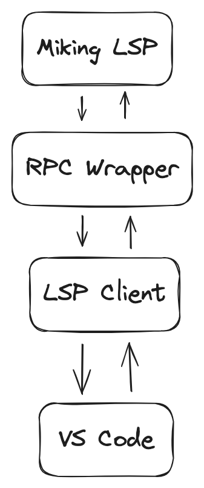

# Miking LSP PoC

### Goto Definition & Hover Support (Type information)

https://github.com/user-attachments/assets/5ffcb3a5-773c-4d26-830c-b3de1d564780

### Code Lens (Run unit tests)

https://github.com/user-attachments/assets/9895db91-e153-4248-858c-d3ae952b0612

### Workspace symbols and show implementations

https://github.com/user-attachments/assets/96e50a1b-94fe-4d06-b2fd-8b3e572ee86c

### Type hierarchy

https://github.com/user-attachments/assets/991cf930-cf41-4e3f-a8dd-c4c6c7d593e2

## Version 1 (legacy)

https://github.com/didrikmunther/miking-lsp-demo/assets/5240046/3fb31104-b3fc-44c9-8262-ad91f5245114

## Requirements

### Programs

1. VS Code
2. Make
3. Node
4. NPM

### Miking

To be able to run this, two changes to the Miking codebase is needed:

* Remove custom colored output for Miking errors.
* Remove printing of dots when utests pass.

[You can use this branch of Miking](https://github.com/didrikmunther/miking/tree/didrik/miking-lsp-demo-changes)

## Usage

1. `make all`
2. Press `F5` in VS Code
3. Open any MCore file
4. Try changing float values to integer values to see diagnostics

## How it works

1. The user opens a plaintext file in VS Code.
2. The LSP client eventually sends a `textDocument/didChange` notification to the LSP client.
3. The Miking LSP server parses the message, compiles the code, and sends a `textDocument/publishDiagnostics` notification with the results to the client.
4. The LSP client forwards the message to VS Code, which displays the diagnostics.

*The RPC header consists of the line `Content-Length: <n>`, describing the length of the JSON body.

## Limitations

- The Miking LSP server doesn't support all LSP features, only the ones needed for this demo.
